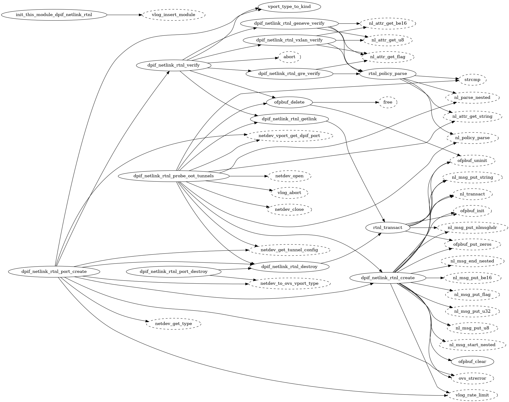
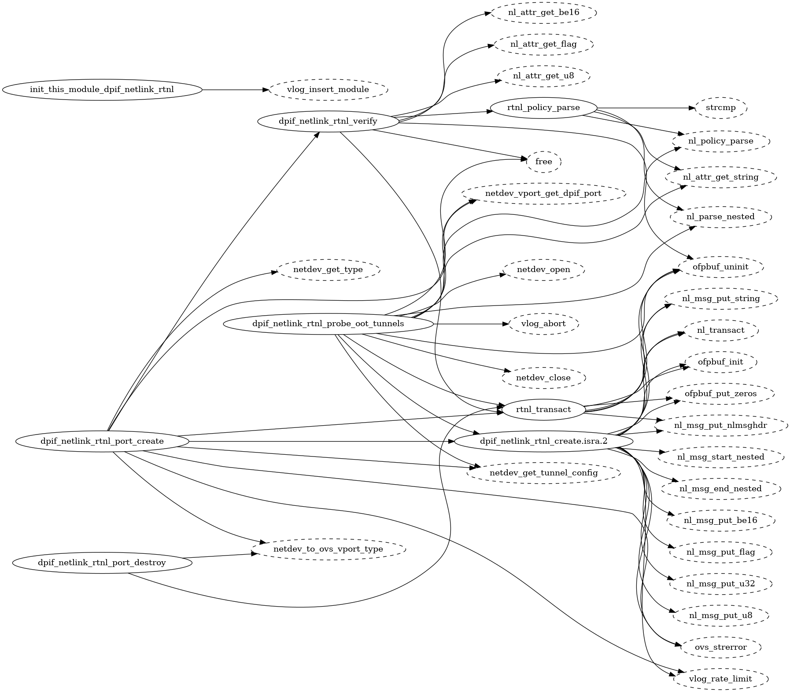
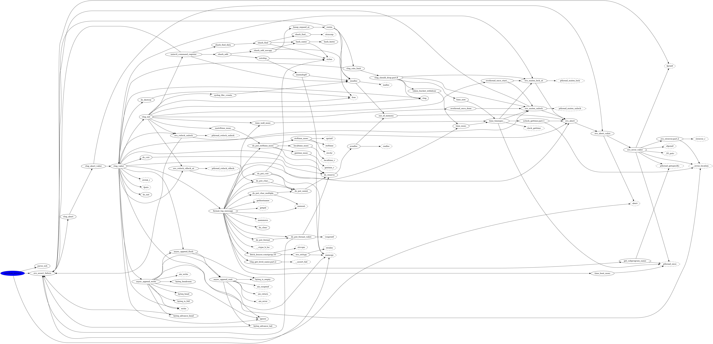
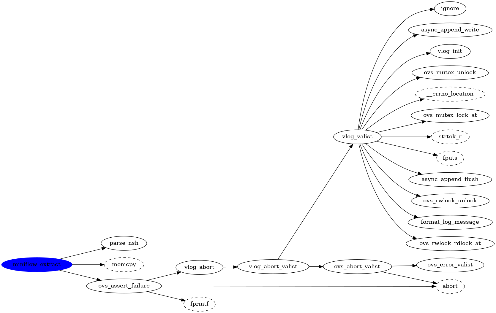
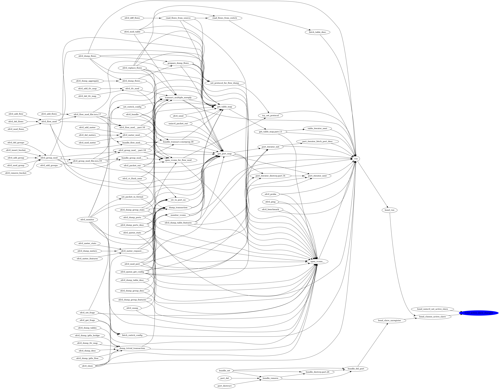
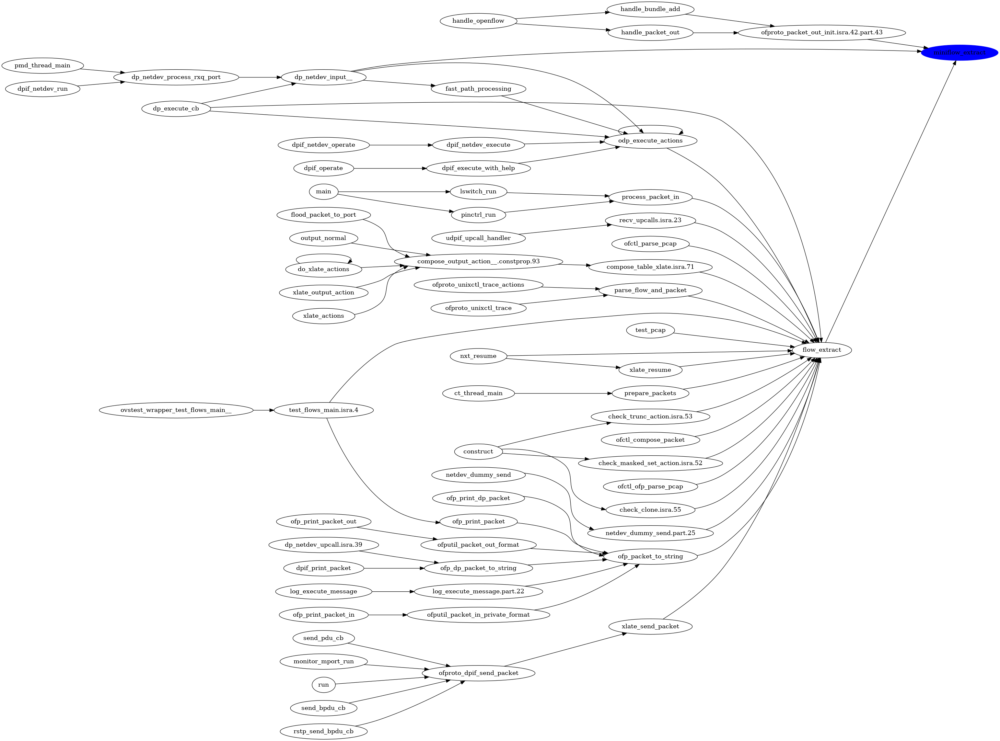

# What is Cally

Cally is a tool that uses GCC's Register Transfer Language (RTL) files to
build a caller or callee call graphs for C projects.

It uses the same concepts as the [egypt](https://www.gson.org/egypt/) tool,
however, this tool is not useful for large projects. The dot file processed
by [Graphviz](http://www.graphviz.org/) will result in a single dark blur image.

Cally either builds a tree for the given function down, i.e. what functions
are being called by this given function. Or it builds a tree resulting in
the paths that lead to the given function to be called. If none is requested it
will build a full map just like [egypt](https://www.gson.org/egypt/).

In addition, it has options to specify the maximum tree depth, and/or a
regular expression for functions to exclude.

__NOTE__: Cally does NOT support indirect function calls!


# Generating RTL files

For the program (or files) you want the generate the GCC RTL data all you have
to do is add the _-fdump-rtl-expand_ option. For simple main.c based project:

```
$ gcc -fdump-rtl-expand main.c
$ ls
a.out  main.c  main.c.229r.expand
```

# Usage

```
usage: cally.py [-h] [-d] [-f [FUNCTION]] [--callee FUNCTION]
                [--caller FUNCTION] [-e REGEX] [--no-externs] [--no-warnings]
                [--max-depth DEPTH]
                RTLFILE [RTLFILE ...]

positional arguments:
  RTLFILE               GCCs RTL .expand file

optional arguments:
  -h, --help            show this help message and exit
  -d, --debug           Enable debugging
  -f [FUNCTION], --functions [FUNCTION]
                        Dump functions name(s)
  --callee FUNCTION     Callgraph for function being called
  --caller FUNCTION     Callgraph for functions being called by
  -e REGEX, --exclude REGEX
                        RegEx for functions to exclude
  --no-externs          Do not show external functions
  --no-warnings         Do not show warnings on console
  --max-depth DEPTH     Maximum tree depth traversal, default no depth
```

If the _--callee_ or _--caller_ option is not supplied, only one can be given
at a time, the full call graph is generated.


# Examples

## Preparation

The examples below are based on the source code of the
[Open vSwitch](http://www.openvswitch.org/) project. To checkout, and build
this project including the RTL files do the following:

```
$ git clone https://github.com/openvswitch/ovs.git ovs_cally
Cloning into 'ovs_cally'...
remote: Counting objects: 127897, done.
remote: Total 127897 (delta 0), reused 0 (delta 0), pack-reused 127896
Receiving objects: 100% (127897/127897), 65.36 MiB | 6.16 MiB/s, done.
Resolving deltas: 100% (102051/102051), done.

$ cd ovs_cally/

$ ./boot.sh
libtoolize: putting auxiliary files in AC_CONFIG_AUX_DIR, 'build-aux'.
libtoolize: copying file 'build-aux/ltmain.sh'
...
...

$ ./configure
checking for a BSD-compatible install... /usr/bin/install -c
checking whether build environment is sane... yes
...
...

$ make -j `nproc` CFLAGS="`sed -n 's/^ *CFLAGS *= *//p' Makefile` -fdump-rtl-expand"
 cd . && /bin/sh /home/echaudro/Documents/Scratch/ovs_cally/build-aux/missing automake-1.15 --foreign Makefile
 cd . && /bin/sh ./config.status Makefile depfiles
...
...
make[2]: Leaving directory '/home/echaudro/Documents/Scratch/ovs_cally'
make[1]: Leaving directory '/home/echaudro/Documents/Scratch/ovs_cally'

```

__NOTE__: Sometimes you are interested in seeing the static functions.
You can get them by adding the following additional
options ```-fno-inline-functions -O0```. But be warned that this might make
the graph messy. You could first start by removing the external
functions ```--no-externs```. If this is still too much, limit the depth of
the graph.


## Complete call graph

Below is the complete call graph for a single file from the Open vSwitch
repository. The first picture was generated from RTL files which had
the ```-fno-inline-functions -O0``` options added, the second one without:

```
$ cally.py ./lib/dpif-netlink-rtnl.c.229r.expand | \
    dot -Grankdir=LR -Tpng -o full_call_graph.png
```

With ```-fno-inline-functions -O0``` it's showing the _static_ functions:

<div align="center">
  
</div>

Without ```-fno-inline-functions -O0``` there are no _static_ functions:

<div align="center">
  
</div>

__NOTE:__ The dashed nodes in the graph are external functions, i.e. not
defined in any of the RTL files given. If you would like to exclude them from
the graph you can use the ```--no-externs``` option.


## Full _caller_ graph

This example will create a full call graph with all functions being called by
_miniflow\_extract()_:

```
$ find . -name *.expand | xargs cally.py --caller miniflow_extract | \
    dot -Grankdir=LR -Tpng -o full_caller.png
```

<div align="center">
  
</div>

__NOTE__: Use ```| dot -Grankdir=LR -Tpdf -o callgraph.pdf``` to create a
searchable PDF document.


## Limited _caller_ graph

This example will create a call graph for _miniflow\_extract()_ with a maximum
depth of 6, and with _ds\_*()_ and _write()_ functions removed:

```
$ find . -name *.expand | xargs cally.py --caller miniflow_extract --max-depth 6 \
    --exclude "ds_.*|write" | dot -Grankdir=LR -Tpng -o limited_caller.png
```

<div align="center">
  
</div>


## Full _callee_ graph

This example will create a full callee graph with all functions calling
_bond\_active\_slave\_changed()_:

```
$ find . -name *.expand | xargs cally.py --callee bond_active_slave_changed  | \
    dot -Grankdir=LR -Tpng -o full_callee.png
```

<div align="center">
  
</div>


## Limited _callee_ graph

Creating a full callee graph for _miniflow\_extract()_ will be possible but
is not very practical. The example below will limit the path depth
to 5 levels, which is enough to get the picture :)


```
$ find . -name *.expand | xargs cally.py --callee miniflow_extract \
    --max-depth 5 | dot -Grankdir=LR -Tpng -o limited_callee.png
```

<div align="center">
  
</div>

